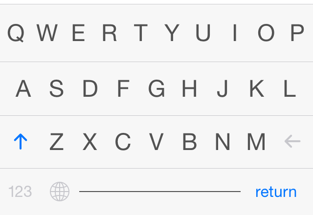

Keyboard
========

I have always had a lot of opinions on software keyboards, so I need to make my own custom keyboard.

The first thing you'll notice is the keys don't have borders. Removing the borders on buttons allow the buttons to look and feel larger.

When first working with the software keyboard on iPhone, you see tons of tiny little buttons. And you think about how you're going to have to press those tiny buttons **a lot**! First time users may try to use the tip of their index finger to poke at the screen to ensure they hit the correct keys. That'll work, but it's incredibly slow and painful. However, that's all an illusion. The keys appear to be small, but with autocorrect, the tap target for the letter keys you want are actually larger and more forgiving. This should be a more realistic and welcoming experience for those new to software keyboards.

Not only will this be more welcoming for new users, but it's great for power users. Gestures can be used to quickly delete words at a time, simulate a press of the return key, dismiss the keyboard, and end the sentence.